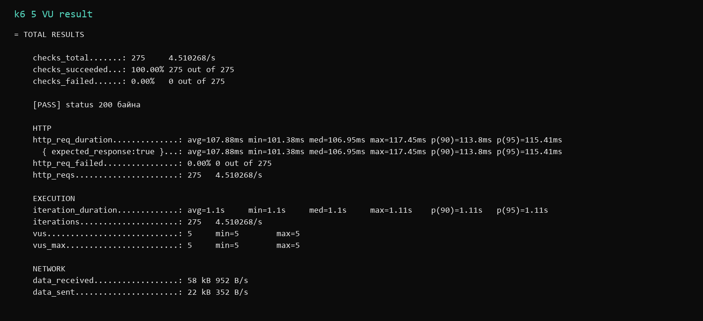
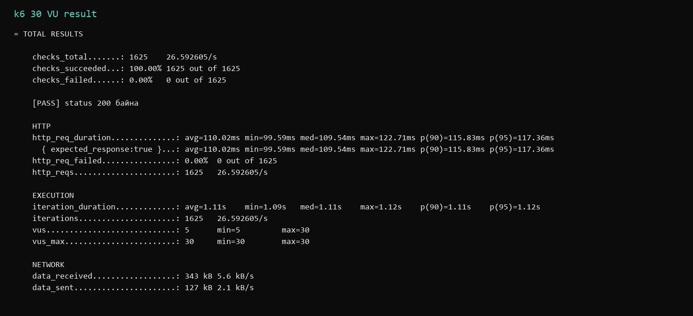
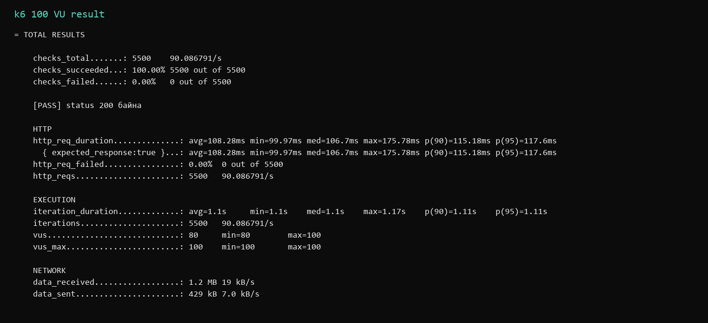
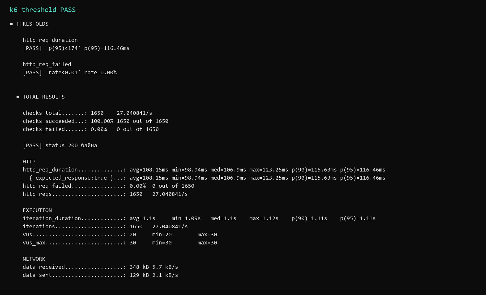
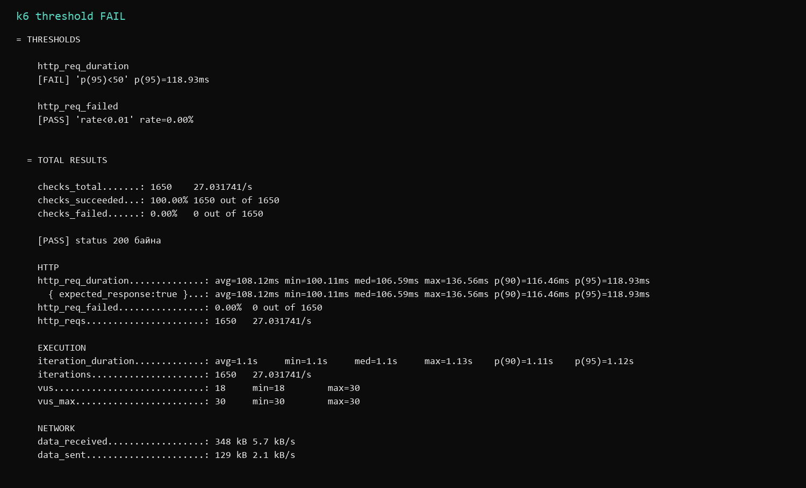

b232270153 С. Энхбаяр

# Лаборатори 2 — Гүйцэтгэлийн хэмжүүрийг k6-аар хэмжих

## Зорилго

Энэ лабораторийн ажлаар local HTTP server дээр k6 ашиглан latency, throughput, error rate хэмжив. Ачааллыг 5, 30, 100 VU болгон тусад нь ажиллуулж, дараа нь stages болон threshold туршилтууд хийсэн.

Repository: <https://github.com/enkhbayr626-commits/F.CSA313_lab_02>

## Ашигласан орчин

- Windows 11
- Node.js local HTTP server
- `k6.exe v2.2.0 (commit/00a9a1b7f5, go1.26.5, windows/amd64)`
- Зөвшөөрөгдсөн бай: `http://127.0.0.1:3000/api/data`

Local server-ийн `/api/data` endpoint хариуг зориуд 100 ms хүлээлгэж буцаадаг. Ингэснээр latency-ийн өөрчлөлтийг ойлгомжтой ажигласан.

## Файлууд

- `server.js` — local HTTP server
- `script.js` — 5, 30, 100 VU-ийн үндсэн тест
- `stages.js` — ачааллыг шатлан өсгөх тест
- `threshold-pass.js` — baseline-д суурилсан PASS SLO
- `threshold-fail.js` — зориуд хатуу болгосон FAIL SLO
- `results/` — k6-ийн бүтэн текст гаралтууд
- `screenshots/` — summary гаралтын зургууд

## Ажиллуулах

Эхлээд server-ээ ажиллуулна.

```powershell
node server.js
```

Дараа нь өөр terminal нээгээд тестүүдийг ажиллуулна.

```powershell
k6 run --vus 5 --duration 1m script.js
k6 run --vus 30 --duration 1m script.js
k6 run --vus 100 --duration 1m script.js
k6 run stages.js
k6 run threshold-pass.js
k6 run threshold-fail.js
```

## 5 30 100 VU-ийн хэмжилт

| VU | p90 latency | p95 latency | Throughput | Error rate | Нийт request |
|---:|---:|---:|---:|---:|---:|
| 5 | 113.80 ms | 115.41 ms | 4.510268 req/s | 0.00% | 275 |
| 30 | 115.83 ms | 117.36 ms | 26.592605 req/s | 0.00% | 1625 |
| 100 | 115.18 ms | 117.60 ms | 90.086791 req/s | 0.00% | 5500 |

Хүснэгтийн утгууд `results/run-05vu.txt`, `results/run-30vu.txt`, `results/run-100vu.txt` файлуудтай таарна. 5-аас 30 VU болоход p95 1.95 ms-ээр өссөн тул нэгж хэрэглэгчийн туршлага бага зэрэг муудаж эхэлсэн. 100 VU дээр p95 бараг тогтвортой байсан боловч хамгийн их latency 175.78 ms болсон.

## Stages туршилт

`stages.js` нь 30 секундэд 5 VU, 1 минутын дотор 30 VU, дараагийн 30 секундэд 100 VU хүрээд 30 секундэд 0 VU хүртэл буусан. Нэгдсэн үр дүнгээр p90 110.42 ms, p95 113.16 ms, throughput 27.603081 req/s, error rate 0.00% гарсан. Stages нь нэг нэгдсэн summary гаргадаг тул дээрх харьцуулсан хүснэгтийн тоог тусдаа гурван ажиллуулалтаас авсан.

## SLO ба threshold

5 VU-ийн baseline p95 нь 115.41 ms байсан. Үүнийг 1.5-аар үржүүлэхэд 173.115 ms болсон тул бодитой бөгөөд бага зэрэг нөөцтэй SLO болгон `p(95) < 174 ms`, error rate-д `rate < 0.01` сонгосон.

- PASS: p95 116.46 ms, error rate 0.00%, хоёр threshold хоёулаа биелсэн.
- FAIL: `p(95) < 50 ms` гэж зориуд хатууруулахад p95 118.93 ms болж threshold зөрчигдөн, k6 exit code 99 буцаасан.

## Гаралтын зургууд

### 5 VU



### 30 VU



### 100 VU



### Stages


### Threshold PASS



### Threshold FAIL



## Дүгнэлт

1. 5 VU үед p95 latency 115.41 ms байсан нь энэ туршилтын baseline боллоо.
2. Ачаалал 30 VU болоход throughput 26.59 req/s болж мэдэгдэхүйц өссөн.
3. Энэ үед p95 117.36 ms болсон тул latency бага зэрэг нэмэгдсэн.
4. 100 VU үед throughput 90.09 req/s хүрсэн нь сервер олон хүсэлтийг зэрэг боловсруулж чадсаныг харуулсан.
5. 100 VU-ийн p95 117.60 ms байсан ч хамгийн их latency 175.78 ms хүрсэн нь оргил утга ачааллаас илүү мэдрэмтгий байгааг харууллаа.
6. Бүх түвшинд error rate 0.00% байсан учраас availability энэ туршилтын хугацаанд сайн байв.
7. Ингэснээр throughput өсөхөд latency болон tail latency-г хамтад нь харах хэрэгтэй гэсэн лекцийн ойлголт батлагдсан.
8. Baseline-аас тооцсон 174 ms-ийн SLO PASS болсон бол 50 ms-ийн хатуу босго санаатайгаар FAIL болсон.
9. k6 threshold нь CI pipeline-д гүйцэтгэлийн quality gate болгон ашиглаж болохыг энэ туршилтаас ойлголоо.

## Ёс зүй

Load тестийг зөвхөн өөрийн local server рүү ажиллуулсан. Сургуулийн болон бусад бодит вебсайт руу ачааллын тест хийгээгүй.
